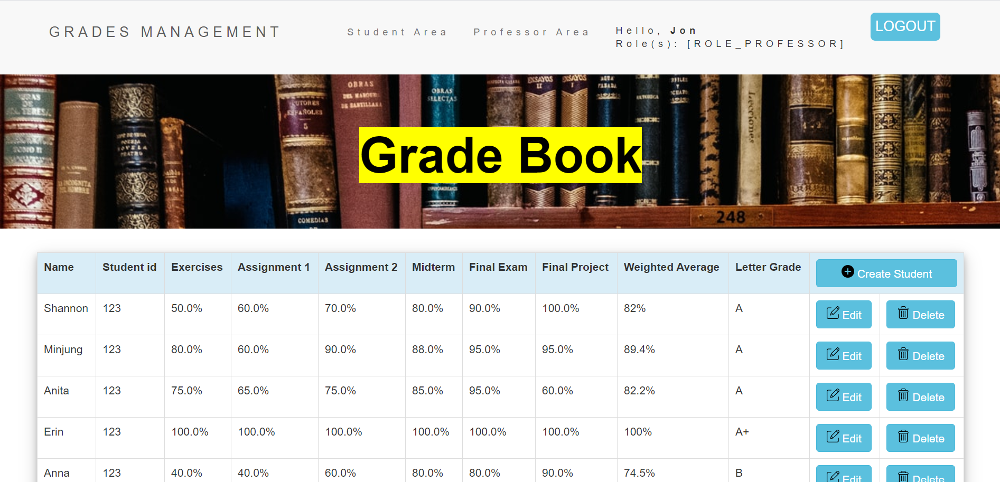
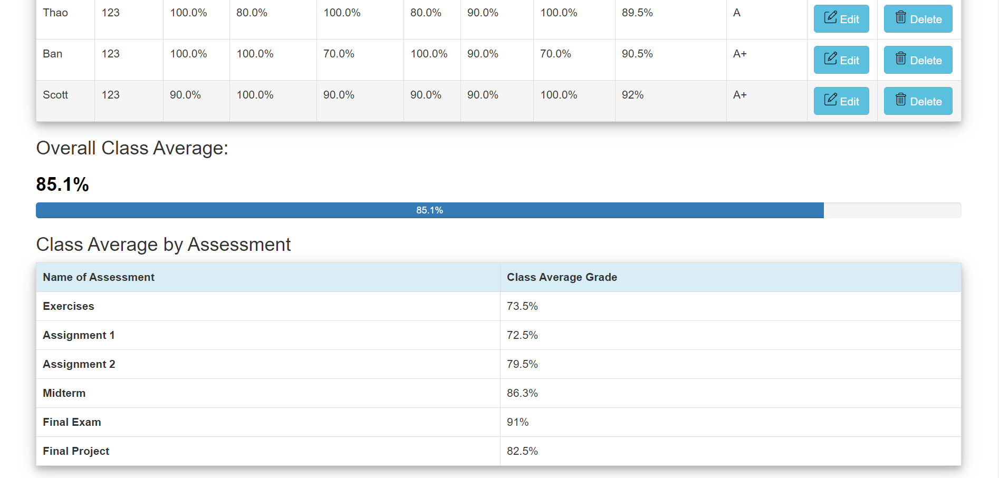
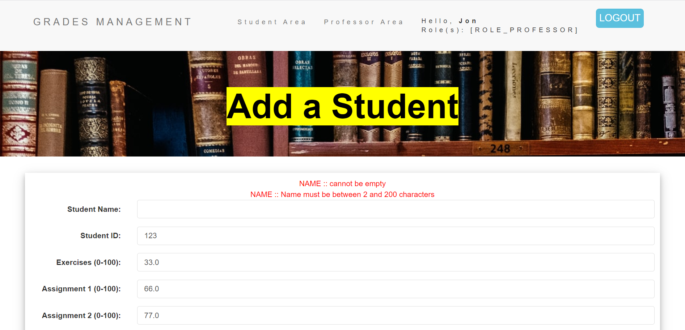
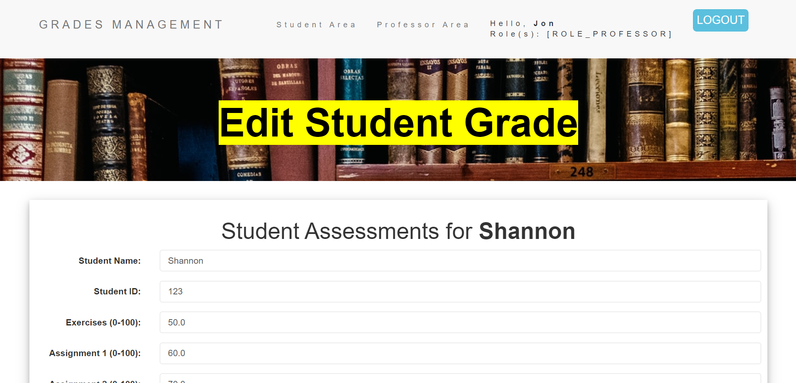
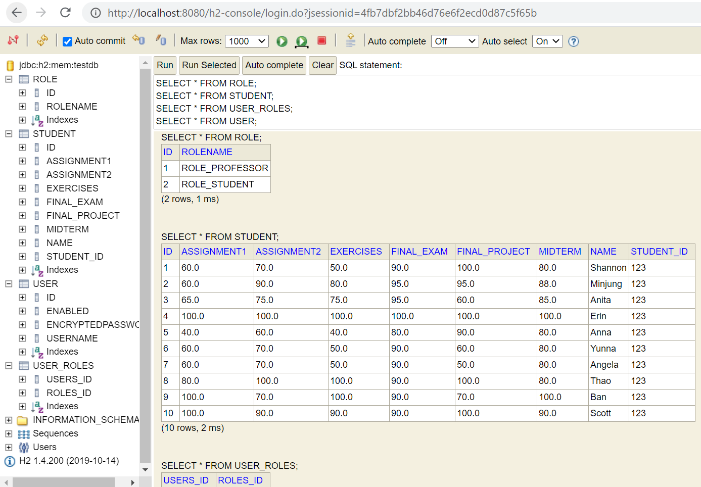
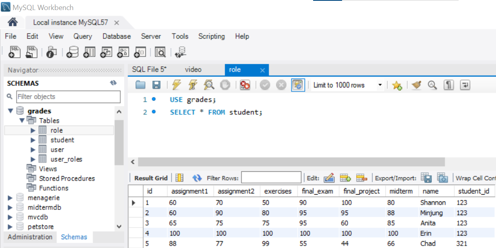

# Grades Management 

- Purpose: Organize student grades and provide CRUD functionality using Java Spring Boot.
- Backend Technologies: Java Spring Boot, Hibernate ORM and Validation, Form Binding with ThymeLeaf, Spring Security and Roles/Authority
- UI: Bootstrap, HTML, CSS
- Result: Received full marks

## Screenshots

1. Professor can add/edit/delete students and update their grades

 
2. Professor can view overall class average and average per assessment

 
3. Professor can add new students and validate using Hibernate Validation at the bean level before we store in the database.

4. Professor can edit the student grade details

 
5. User should have proper authority(role) to access Professor area or pages ending in /professor/**

 
6. H2 In-memory database, Notice that passwords are salted(encrypted) before stored in database.

 
7. After testing with In-memory database, we can then change to MySQL database. See screenshot of MySQL WorkBench queries and results.

